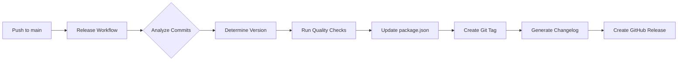

# GitHub Actions Release Automation Setup

This document provides a comprehensive overview of the automated release system implemented for OpenLeague.

## 📦 What Was Added

### GitHub Actions Workflows

1. **`.github/workflows/release.yml`** - Main automated release workflow
   - Triggers on push to `main` or manual dispatch
   - Analyzes commits and determines semantic version bump
   - Updates package.json automatically
   - Creates Git tags and GitHub releases
   - Generates categorized changelog

2. **`.github/workflows/tag-release.yml`** - Tag-based release workflow
   - Triggers on manual tag push (v*.*.*)
   - Validates semantic versioning format
   - Creates releases from tags
   - Supports pre-release versions

3. **`.github/workflows/version-check.yml`** - PR version validation
   - Triggers on PRs to main that modify package.json
   - Validates version bumps
   - Posts analysis comment on PRs
   - Fails on invalid version changes

### Configuration Files

4. **`.github/release.yml`** - GitHub release notes configuration
   - Defines changelog categories
   - Maps PR labels to sections
   - Excludes automated commits

5. **`.github/RELEASE_TEMPLATE.md`** - Release checklist and guide
   - Pre-release checklist
   - Release creation instructions
   - Post-release tasks
   - Rollback procedures

### Documentation

6. **`.github/workflows/README.md`** - Workflow documentation
   - Detailed workflow descriptions
   - Usage instructions
   - Troubleshooting guide

7. **`.github/CONTRIBUTING.md`** - Contribution guidelines
   - Development workflow
   - Code style guide
   - Commit message conventions
   - Release process for contributors

8. **`.github/AUTOMATION.md`** - Automation summary
   - Quick start guide
   - Commit message impact table
   - Examples and best practices
   - Monitoring and troubleshooting

## 🎯 How It Works

### Automatic Release Flow



### Version Determination Logic

The release workflow analyzes commit messages since the last release:

| Commit Pattern | Version Bump | Example |
|---------------|--------------|---------|
| `feat:` or `feature:` | **Minor** (0.X.0) | `feat: add CSV export` |
| `fix:` or `bugfix:` | **Patch** (0.0.X) | `fix: resolve RSVP bug` |
| `feat!:` or `BREAKING CHANGE:` | **Major** (X.0.0) | `feat!: redesign API` |
| Other types | None | `docs:`, `chore:`, etc. |

### Manual Release Options

**Option 1: Workflow Dispatch**
```bash
gh workflow run release.yml -f version=1.2.3
```

**Option 2: Git Tag**
```bash
git tag -a v1.2.3 -m "Release v1.2.3"
git push origin v1.2.3
```

## 🚀 Usage Examples

### Example 1: Feature Development

```bash
# Create feature branch
git checkout -b feat/roster-export

# Make changes and commit
git commit -m "feat: add roster export to CSV"
git commit -m "docs: update export documentation"

# Merge to main
git checkout main
git merge feat/roster-export
git push origin main

# Result: Automatic release v0.1.0 → v0.2.0 (minor bump)
```

### Example 2: Bug Fix

```bash
# Create hotfix branch
git checkout -b fix/rsvp-validation

# Fix bug
git commit -m "fix: validate RSVP input correctly"

# Merge to main
git push origin main

# Result: Automatic release v0.2.0 → v0.2.1 (patch bump)
```

### Example 3: Breaking Change

```bash
# Major refactor
git checkout -b refactor/auth-redesign

# Make breaking changes
git commit -m "feat!: redesign authentication system

BREAKING CHANGE: Old auth tokens are no longer valid.
Users must re-authenticate after this update."

# Merge to main
git push origin main

# Result: Automatic release v0.2.1 → v1.0.0 (major bump)
```

## 🔍 Quality Checks

Every release runs these checks before creating a release:

1. **Type Checking**: `bun run type-check` (TypeScript validation)
2. **Linting**: `bun run lint` (ESLint code quality)
3. **Build**: `bun run build` (Next.js production build)

If any check fails, the release is aborted and no tag is created.

## 📋 Changelog Categories

Releases automatically categorize changes:

- 🚨 **Breaking Changes** - Major version bumps
- ✨ **New Features** - New functionality
- 🐛 **Bug Fixes** - Bug fixes and patches
- 📚 **Documentation** - Documentation updates
- 🏗️ **Infrastructure** - CI/CD and deployment
- 🔧 **Configuration** - Config file changes
- 🎨 **Styling** - UI/UX improvements
- ⚡ **Performance** - Optimizations
- 🔒 **Security** - Security patches
- 🧪 **Testing** - Test additions/updates
- 📦 **Dependencies** - Dependency updates
- 🔄 **Other Changes** - Everything else

## 🔐 Permissions

Workflows use `GITHUB_TOKEN` with these permissions:

- `contents: write` - Create tags and releases
- `pull-requests: write` - Comment on PRs (version check)
- `issues: write` - Update issues in releases

These are automatically provided by GitHub Actions.

## 🛠️ Configuration

### Required Environment Variables

None required for CI workflows. GitHub token is provided automatically.

### Optional Inputs

**Release Workflow**:
- `version` (manual dispatch only) - Specify exact version to release

**Tag Release Workflow**:
- None - triggered by tag push pattern

## 📊 Monitoring

### View Workflow Runs

```bash
# List recent runs
gh run list --workflow=release.yml --limit 5

# Watch latest run
gh run watch

# View specific run
gh run view <run-id> --log
```

### Check Release Status

```bash
# List all releases
gh release list

# View latest release
gh release view --json tagName,publishedAt

# View specific release
gh release view v1.2.3
```

### Check Version Info

```bash
# Current package.json version
cat package.json | jq .version

# Latest git tag
git describe --tags --abbrev=0

# All tags
git tag -l
```

## 🐛 Troubleshooting

### Release Didn't Trigger

**Symptoms**: Push to main but no release created

**Check**:
1. Does commit message contain `[skip ci]`?
2. Did quality checks pass?
3. Were there any actual changes?
4. Is the push actually on `main` branch?

**Solution**:
```bash
# View recent commits
git log --oneline -5

# Check workflow runs
gh run list --workflow=release.yml --limit 3
```

### Invalid Version Error

**Symptoms**: Version check workflow fails on PR

**Causes**:
- Version decreased instead of increased
- Version format invalid (not X.Y.Z)
- Version unchanged when it should change

**Solution**:
```bash
# Fix version in package.json
# Ensure it's higher than base branch
# Follow semantic versioning (X.Y.Z)
```

### Duplicate Tag Error

**Symptoms**: Tag already exists

**Solution**:
```bash
# Delete local tag
git tag -d v1.2.3

# Delete remote tag
git push origin :refs/tags/v1.2.3

# Re-create with correct version
git tag -a v1.2.4 -m "Release v1.2.4"
git push origin v1.2.4
```

## 🎓 Best Practices

### Do's ✅

- ✅ Use conventional commit format consistently
- ✅ Let automation handle version bumps
- ✅ Review version-check comments on PRs
- ✅ Run quality checks locally before pushing
- ✅ Use descriptive commit messages
- ✅ Group related changes in single commit

### Don'ts ❌

- ❌ Manually edit version in package.json on main
- ❌ Create duplicate tags
- ❌ Skip CI checks
- ❌ Force push to main branch
- ❌ Ignore workflow failures
- ❌ Mix multiple change types in one commit

## 📚 Related Documentation

- [Workflows README](.github/workflows/README.md) - Detailed workflow documentation
- [Contributing Guide](.github/CONTRIBUTING.md) - Development workflow
- [Release Template](.github/RELEASE_TEMPLATE.md) - Release checklist
- [Automation Summary](.github/AUTOMATION.md) - Quick reference guide

## 🔄 Future Enhancements

Potential improvements for the release automation:

- [ ] Automated testing integration
- [ ] Docker image building and publishing
- [ ] npm package publishing (if applicable)
- [ ] Slack/Discord notifications
- [ ] Deployment status checks
- [ ] Rollback automation
- [ ] Release branch strategy
- [ ] Automated security scanning

## 📞 Support

If you encounter issues:

1. Check [Troubleshooting](#-troubleshooting) section
2. Review [workflow logs](https://github.com/mbeacom/openleague/actions)
3. Read related documentation
4. Open an issue with `ci` label

## ✅ Testing the Setup

To verify the automation works:

```bash
# 1. Create test branch
git checkout -b test/release-automation

# 2. Make a small change
echo "# Test" >> docs/test.md
git add docs/test.md
git commit -m "test: verify release automation"

# 3. Push to main (or create PR first)
git checkout main
git merge test/release-automation
git push origin main

# 4. Watch workflow run
gh run watch

# 5. Check release created
gh release list

# 6. Verify version bumped
cat package.json | jq .version
```

---

**Status**: ✅ Complete and ready to use!

**Last Updated**: October 5, 2025

**Maintainer**: Mark Beacom (@mbeacom)
