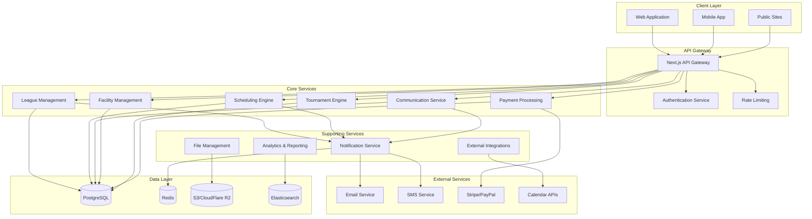

# Design Document

## Overview

The OpenLeague Platform is a comprehensive, enterprise-grade league management system built on Next.js 14+ with a microservices-ready architecture. The platform expands significantly from the team-management-mvp to handle complex multi-tenant scenarios, real-time communication, advanced scheduling algorithms, and enterprise-level integrations.

The system follows a modular monolith approach that can evolve into microservices, using Next.js App Router, TypeScript, React 19, and MUI v7. The architecture supports multi-tenancy at the league level, with sophisticated role-based access control, real-time features via WebSockets, and comprehensive API integrations.

**Key Architectural Principles:**
- **Multi-tenant by design**: Each league operates as an isolated tenant with shared infrastructure
- **Event-driven architecture**: Critical operations trigger events for real-time updates and integrations
- **API-first design**: All functionality exposed via comprehensive REST and GraphQL APIs
- **Microservice-ready**: Modular design allows future extraction of services (payments, communications, scheduling)
- **Performance-optimized**: Caching, CDN, database optimization for large-scale operations

## Architecture

### High-Level System Architecture



### Technology Stack

**Core Platform:**
- **Frontend**: React 19, Next.js 14+, MUI v7, Emotion
- **Backend**: Next.js Server Actions, API Routes, tRPC for type-safe APIs
- **Database**: PostgreSQL (primary), Redis (caching/sessions), Elasticsearch (search/analytics)
- **Authentication**: Auth.js with multiple providers (credentials, OAuth, SAML for enterprise)
- **Real-time**: WebSockets via Socket.io, Server-Sent Events
- **File Storage**: AWS S3 or Cloudflare R2 with CDN
- **Email**: AWS SES, Mailchimp Transactional, or SendGrid
- **SMS**: Twilio, AWS SNS
- **Payments**: Stripe, PayPal, Square
- **Deployment**: Vercel (frontend), AWS ECS/Lambda (backend services)

**Development Tools:**
- **Package Manager**: Bun
- **Testing**: Vitest, Playwright, Jest
- **Code Quality**: ESLint, Prettier, TypeScript strict mode
- **Monitoring**: Sentry, DataDog, or New Relic
- **CI/CD**: GitHub Actions, Vercel deployments

### Multi-Tenant Architecture

**Tenant Isolation Strategy:**
- **Database**: Single database with tenant_id column on all tables (row-level security)
- **Data Access**: All queries automatically filtered by tenant context
- **File Storage**: Tenant-specific S3 buckets or prefixed paths
- **Caching**: Tenant-aware cache keys
- **Custom Domains**: Support for league-specific domains with SSL

**Tenant Context Management:**
```typescript
// Tenant context provider
interface TenantContext {
  leagueId: string;
  permissions: Permission[];
  customization: LeagueCustomization;
}

// Automatic tenant filtering in data access layer
class TenantAwareRepository<T> {
  async find(criteria: any): Promise<T[]> {
    return this.db.find({
      ...criteria,
      leagueId: this.tenantContext.leagueId
    });
  }
}
```

## Data Models

### Enhanced Prisma Schema

```prisma
// League (Tenant) model
model League {
  id                String    @id @default(cuid())
  name              String
  slug              String    @unique // For custom domains
  sport             String
  organizationType  String    // Club, Association, School, etc.
  contactEmail      String
  contactPhone      String?
  address           String?
  website           String?
  logoUrl           String?
  customization     Json?     // Theme, branding, feature flags
  subscriptionTier  String    @default("FREE") // FREE, BASIC, PRO, ENTERPRISE
  isActive          Boolean   @default(true)
  createdAt         DateTime  @default(now())
  updatedAt         DateTime  @updatedAt

  // Relationships
  divisions         Division[]
  teams             Team[]
  facilities        Facility[]
  tournaments       Tournament[]
  users             LeagueUser[]
  seasons           Season[]
  customFields      CustomField[]
  
  @@map("leagues")
}

// Enhanced User model with multi-league support
model User {
  id            String    @id @default(cuid())
  email         String    @unique
  passwordHash  String?   // Optional for OAuth users
  name          String
  phone         String?
  avatar        String?
  isActive      Boolean   @default(true)
  lastLoginAt   DateTime?
  createdAt     DateTime  @default(now())
  updatedAt     DateTime  @updatedAt

  // Multi-league relationships
  leagueUsers   LeagueUser[]
  
  // OAuth providers
  accounts      Account[]
  sessions      Session[]
  
  @@map("users")
}

// Junction table for User-League relationships with roles
model LeagueUser {
  id        String   @id @default(cuid())
  role      UserRole
  isActive  Boolean  @default(true)
  joinedAt  DateTime @default(now())

  userId    String
  user      User     @relation(fields: [userId], references: [id], onDelete: Cascade)

  leagueId  String
  league    League   @relation(fields: [leagueId], references: [id], onDelete: Cascade)

  // Team-specific relationships
  teamMemberships TeamMember[]
  
  @@unique([userId, leagueId])
  @@map("league_users")
}

enum UserRole {
  SYSTEM_ADMIN      // Platform administrator
  LEAGUE_ADMIN      // Full league control
  DIVISION_MANAGER  // Division-level management
  TEAM_ADMIN        // Team management
  FACILITY_MANAGER  // Facility management
  TOURNAMENT_DIRECTOR // Tournament management
  VOLUNTEER_COORDINATOR // Volunteer management
  MEMBER            // Basic member
  PARENT            // Parent/guardian
  PLAYER            // Player account
}

// Division model for organizing teams
model Division {
  id          String   @id @default(cuid())
  name        String
  description String?
  ageGroup    String?  // U8, U10, Adult, etc.
  skillLevel  String?  // Recreational, Competitive, Elite
  gender      String?  // Male, Female, Mixed
  maxTeams    Int?
  isActive    Boolean  @default(true)
  createdAt   DateTime @default(now())
  updatedAt   DateTime @updatedAt

  leagueId    String
  league      League   @relation(fields: [leagueId], references: [id], onDelete: Cascade)

  teams       Team[]
  tournaments Tournament[]
  
  @@map("divisions")
}

// Enhanced Team model
model Team {
  id              String   @id @default(cuid())
  name            String
  shortName       String?  // Abbreviation
  logoUrl         String?
  primaryColor    String?
  secondaryColor  String?
  homeVenue       String?
  isActive        Boolean  @default(true)
  maxPlayers      Int?
  registrationFee Decimal?
  createdAt       DateTime @default(now())
  updatedAt       DateTime @updatedAt

  leagueId        String
  league          League   @relation(fields: [leagueId], references: [id], onDelete: Cascade)

  divisionId      String?
  division        Division? @relation(fields: [divisionId], references: [id])

  // Relationships
  members         TeamMember[]
  players         Player[]
  events          Event[]
  homeEvents      Event[]  @relation("HomeTeam")
  awayEvents      Event[]  @relation("AwayTeam")
  
  @@map("teams")
}

// Enhanced Player model with custom fields
model Player {
  id                String   @id @default(cuid())
  jerseyNumber      String?
  position          String?
  emergencyContact  String?
  emergencyPhone    String?
  medicalInfo       String?
  customFields      Json?    // Flexible custom data
  isActive          Boolean  @default(true)
  registrationDate  DateTime @default(now())
  createdAt         DateTime @default(now())
  updatedAt         DateTime @updatedAt

  // Link to user account (optional)
  userId            String?
  user              User?    @relation(fields: [userId], references: [id])

  teamId            String
  team              Team     @relation(fields: [teamId], references: [id], onDelete: Cascade)

  leagueId          String
  league            League   @relation(fields: [leagueId], references: [id], onDelete: Cascade)
  
  @@map("players")
}

// Facility management
model Facility {
  id          String   @id @default(cuid())
  name        String
  address     String
  city        String
  state       String
  zipCode     String
  country     String   @default("US")
  phone       String?
  email       String?
  website     String?
  description String?
  amenities   String[] // Parking, Concessions, etc.
  capacity    Int?
  isActive    Boolean  @default(true)
  createdAt   DateTime @default(now())
  updatedAt   DateTime @updatedAt

  leagueId    String
  league      League   @relation(fields: [leagueId], references: [id], onDelete: Cascade)

  spaces      FacilitySpace[]
  events      Event[]
  bookings    FacilityBooking[]
  
  @@map("facilities")
}

// Individual spaces within facilities
model FacilitySpace {
  id          String   @id @default(cuid())
  name        String   // Rink 1, Field A, Court 2
  sportTypes  String[] // Hockey, Soccer, Basketball
  capacity    Int?
  hourlyRate  Decimal?
  isActive    Boolean  @default(true)
  
  facilityId  String
  facility    Facility @relation(fields: [facilityId], references: [id], onDelete: Cascade)

  events      Event[]
  bookings    FacilityBooking[]
  availability FacilityAvailability[]
  
  @@map("facility_spaces")
}

// Facility booking system
model FacilityBooking {
  id          String      @id @default(cuid())
  startTime   DateTime
  endTime     DateTime
  purpose     String      // Practice, Game, Tournament, Private
  status      BookingStatus @default(PENDING)
  totalCost   Decimal?
  notes       String?
  createdAt   DateTime    @default(now())
  updatedAt   DateTime    @updatedAt

  facilityId  String
  facility    Facility    @relation(fields: [facilityId], references: [id])

  spaceId     String?
  space       FacilitySpace? @relation(fields: [spaceId], references: [id])

  bookedById  String
  bookedBy    User        @relation(fields: [bookedById], references: [id])

  teamId      String?
  team        Team?       @relation(fields: [teamId], references: [id])

  eventId     String?     @unique
  event       Event?      @relation(fields: [eventId], references: [id])
  
  @@map("facility_bookings")
}

enum BookingStatus {
  PENDING
  CONFIRMED
  CANCELLED
  COMPLETED
}

// Enhanced Event model with facility integration
model Event {
  id              String      @id @default(cuid())
  type            EventType
  title           String
  description     String?
  startAt         DateTime
  endAt           DateTime?
  isAllDay        Boolean     @default(false)
  status          EventStatus @default(SCHEDULED)
  isPublic        Boolean     @default(false)
  maxAttendees    Int?
  registrationFee Decimal?
  createdAt       DateTime    @default(now())
  updatedAt       DateTime    @updatedAt

  leagueId        String
  league          League      @relation(fields: [leagueId], references: [id], onDelete: Cascade)

  teamId          String?
  team            Team?       @relation(fields: [teamId], references: [id])

  homeTeamId      String?
  homeTeam        Team?       @relation("HomeTeam", fields: [homeTeamId], references: [id])

  awayTeamId      String?
  awayTeam        Team?       @relation("AwayTeam", fields: [awayTeamId], references: [id])

  facilityId      String?
  facility        Facility?   @relation(fields: [facilityId], references: [id])

  spaceId         String?
  space           FacilitySpace? @relation(fields: [spaceId], references: [id])

  tournamentId    String?
  tournament      Tournament? @relation(fields: [tournamentId], references: [id])

  // Relationships
  rsvps           RSVP[]
  booking         FacilityBooking?
  officials       EventOfficial[]
  volunteers      EventVolunteer[]
  
  @@map("events")
}

enum EventType {
  GAME
  PRACTICE
  TOURNAMENT
  MEETING
  SOCIAL
  VOLUNTEER
  OTHER
}

enum EventStatus {
  SCHEDULED
  CANCELLED
  POSTPONED
  COMPLETED
  IN_PROGRESS
}

// Tournament management
model Tournament {
  id              String         @id @default(cuid())
  name            String
  description     String?
  format          TournamentFormat
  status          TournamentStatus @default(UPCOMING)
  startDate       DateTime
  endDate         DateTime
  registrationStart DateTime?
  registrationEnd DateTime?
  entryFee        Decimal?
  maxTeams        Int?
  isPublic        Boolean        @default(false)
  rules           String?
  prizes          String?
  createdAt       DateTime       @default(now())
  updatedAt       DateTime       @updatedAt

  leagueId        String
  league          League         @relation(fields: [leagueId], references: [id], onDelete: Cascade)

  divisionId      String?
  division        Division?      @relation(fields: [divisionId], references: [id])

  // Relationships
  registrations   TournamentRegistration[]
  brackets        TournamentBracket[]
  events          Event[]
  
  @@map("tournaments")
}

enum TournamentFormat {
  SINGLE_ELIMINATION
  DOUBLE_ELIMINATION
  ROUND_ROBIN
  POOL_PLAY
  SWISS
}

enum TournamentStatus {
  UPCOMING
  REGISTRATION_OPEN
  REGISTRATION_CLOSED
  IN_PROGRESS
  COMPLETED
  CANCELLED
}

// Communication system
model Message {
  id          String      @id @default(cuid())
  subject     String?
  content     String
  messageType MessageType
  priority    Priority    @default(NORMAL)
  isRead      Boolean     @default(false)
  sentAt      DateTime    @default(now())

  senderId    String
  sender      User        @relation(fields: [senderId], references: [id])

  leagueId    String
  league      League      @relation(fields: [leagueId], references: [id], onDelete: Cascade)

  // Targeting
  recipients  MessageRecipient[]
  
  @@map("messages")
}

enum MessageType {
  EMAIL
  SMS
  PUSH_NOTIFICATION
  IN_APP
  CHAT
}

enum Priority {
  LOW
  NORMAL
  HIGH
  URGENT
}

// Volunteer management
model VolunteerRole {
  id              String   @id @default(cuid())
  name            String
  description     String?
  requiredHours   Int?
  requiresTraining Boolean  @default(false)
  requiresBackground Boolean @default(false)
  isActive        Boolean  @default(true)
  createdAt       DateTime @default(now())

  leagueId        String
  league          League   @relation(fields: [leagueId], references: [id], onDelete: Cascade)

  assignments     VolunteerAssignment[]
  
  @@map("volunteer_roles")
}

// Payment processing
model Payment {
  id              String        @id @default(cuid())
  amount          Decimal
  currency        String        @default("USD")
  status          PaymentStatus
  paymentMethod   String        // card, bank_transfer, cash
  stripePaymentId String?
  description     String?
  paidAt          DateTime?
  createdAt       DateTime      @default(now())
  updatedAt       DateTime      @updatedAt

  payerId         String
  payer           User          @relation(fields: [payerId], references: [id])

  leagueId        String
  league          League        @relation(fields: [leagueId], references: [id], onDelete: Cascade)

  // Payment can be for various purposes
  registrationId  String?
  registration    Registration? @relation(fields: [registrationId], references: [id])

  bookingId       String?
  booking         FacilityBooking? @relation(fields: [bookingId], references: [id])

  tournamentId    String?
  tournament      Tournament?   @relation(fields: [tournamentId], references: [id])
  
  @@map("payments")
}

enum PaymentStatus {
  PENDING
  PROCESSING
  COMPLETED
  FAILED
  REFUNDED
  CANCELLED
}

// Custom fields for extensibility
model CustomField {
  id          String          @id @default(cuid())
  name        String
  fieldType   CustomFieldType
  isRequired  Boolean         @default(false)
  options     String[]        // For select/radio fields
  defaultValue String?
  helpText    String?
  isActive    Boolean         @default(true)
  
  leagueId    String
  league      League          @relation(fields: [leagueId], references: [id], onDelete: Cascade)

  // What entity this field applies to
  entityType  String          // player, team, event, etc.
  
  @@map("custom_fields")
}

enum CustomFieldType {
  TEXT
  NUMBER
  EMAIL
  PHONE
  DATE
  BOOLEAN
  SELECT
  MULTI_SELECT
  TEXTAREA
}
```

## Core Services Design

### League Management Service

**Responsibilities:**
- Multi-tenant league creation and management
- Division and team organization
- User role and permission management
- League customization and branding

**Key Components:**
```typescript
class LeagueService {
  async createLeague(data: CreateLeagueInput): Promise<League>
  async updateLeagueSettings(leagueId: string, settings: LeagueSettings): Promise<League>
  async manageDivisions(leagueId: string, divisions: DivisionInput[]): Promise<Division[]>
  async assignUserRole(leagueId: string, userId: string, role: UserRole): Promise<void>
  async getLeagueHierarchy(leagueId: string): Promise<LeagueHierarchy>
}
```

### Scheduling Engine

**Advanced Scheduling Capabilities:**
- Multi-team conflict detection
- Facility availability optimization
- Automated schedule generation
- Constraint-based scheduling (blackout dates, preferences)

**Scheduling Algorithm:**
```typescript
interface SchedulingConstraints {
  blackoutDates: Date[];
  facilityPreferences: FacilityPreference[];
  teamAvailability: TeamAvailability[];
  minimumRestPeriod: number; // hours between games
  maxGamesPerDay: number;
}

class SchedulingEngine {
  async generateSchedule(
    teams: Team[],
    facilities: Facility[],
    constraints: SchedulingConstraints
  ): Promise<Schedule>
  
  async detectConflicts(events: Event[]): Promise<SchedulingConflict[]>
  async optimizeFacilityUsage(schedule: Schedule): Promise<Schedule>
}
```

### Communication Service

**Multi-Channel Communication:**
- Email campaigns with templates
- SMS notifications
- Push notifications
- Real-time chat system
- Emergency broadcast system

**Implementation:**
```typescript
class CommunicationService {
  async sendTargetedMessage(
    leagueId: string,
    message: Message,
    targeting: MessageTargeting
  ): Promise<void>
  
  async createChatChannel(
    leagueId: string,
    channelType: ChannelType,
    participants: string[]
  ): Promise<ChatChannel>
  
  async sendEmergencyAlert(
    leagueId: string,
    alert: EmergencyAlert
  ): Promise<void>
}

interface MessageTargeting {
  divisions?: string[];
  teams?: string[];
  roles?: UserRole[];
  customSegments?: string[];
}
```

### Facility Management Service

**Comprehensive Facility Operations:**
- Multi-facility management
- Space booking and availability
- Pricing and payment integration
- Self-service booking portal
- Resource and equipment tracking

**Key Features:**
```typescript
class FacilityService {
  async checkAvailability(
    facilityId: string,
    startTime: DateTime,
    endTime: DateTime
  ): Promise<AvailabilityResult>
  
  async createBooking(
    booking: BookingRequest,
    paymentInfo?: PaymentInfo
  ): Promise<FacilityBooking>
  
  async generateUsageReport(
    facilityId: string,
    dateRange: DateRange
  ): Promise<UsageReport>
}
```

### Tournament Management Service

**Complete Tournament Operations:**
- Tournament creation and registration
- Bracket generation and management
- Live scoring and results
- Public tournament pages
- Prize and award tracking

**Tournament Engine:**
```typescript
class TournamentService {
  async createTournament(tournament: TournamentInput): Promise<Tournament>
  async generateBrackets(tournamentId: string, format: TournamentFormat): Promise<Bracket[]>
  async updateScore(gameId: string, score: GameScore): Promise<void>
  async advanceBracket(tournamentId: string): Promise<Bracket[]>
}
```

## Real-Time Features

### WebSocket Implementation

**Real-Time Capabilities:**
- Live chat messaging
- Schedule change notifications
- Tournament bracket updates
- Emergency alerts
- Facility booking updates

**Socket.io Integration:**
```typescript
// Server-side socket handling
io.on('connection', (socket) => {
  socket.on('join-league', (leagueId) => {
    socket.join(`league:${leagueId}`);
  });
  
  socket.on('join-team-chat', (teamId) => {
    socket.join(`team:${teamId}:chat`);
  });
  
  socket.on('send-message', async (data) => {
    const message = await saveMessage(data);
    io.to(`team:${data.teamId}:chat`).emit('new-message', message);
  });
});

// Client-side real-time updates
const useRealTimeUpdates = (leagueId: string) => {
  useEffect(() => {
    socket.emit('join-league', leagueId);
    
    socket.on('schedule-update', (update) => {
      // Update local state
      queryClient.invalidateQueries(['schedule']);
    });
    
    socket.on('emergency-alert', (alert) => {
      // Show emergency notification
      showEmergencyAlert(alert);
    });
  }, [leagueId]);
};
```

## API Design

### RESTful API Structure

**API Organization:**
```
/api/v1/
├── leagues/
│   ├── {leagueId}/
│   │   ├── divisions/
│   │   ├── teams/
│   │   ├── facilities/
│   │   ├── tournaments/
│   │   ├── users/
│   │   └── settings/
├── scheduling/
│   ├── events/
│   ├── conflicts/
│   └── generate/
├── communications/
│   ├── messages/
│   ├── channels/
│   └── templates/
├── facilities/
│   ├── bookings/
│   ├── availability/
│   └── reports/
└── tournaments/
    ├── brackets/
    ├── scores/
    └── standings/
```

### GraphQL API

**Unified Data Access:**
```graphql
type League {
  id: ID!
  name: String!
  divisions: [Division!]!
  teams: [Team!]!
  facilities: [Facility!]!
  tournaments: [Tournament!]!
  customization: LeagueCustomization
}

type Query {
  league(id: ID!): League
  schedule(leagueId: ID!, filters: ScheduleFilters): [Event!]!
  facilityAvailability(facilityId: ID!, dateRange: DateRange!): [TimeSlot!]!
  tournamentBrackets(tournamentId: ID!): [Bracket!]!
}

type Mutation {
  createEvent(input: CreateEventInput!): Event!
  bookFacility(input: BookingInput!): FacilityBooking!
  sendMessage(input: MessageInput!): Message!
  updateTournamentScore(gameId: ID!, score: ScoreInput!): Game!
}

type Subscription {
  scheduleUpdates(leagueId: ID!): Event!
  chatMessages(channelId: ID!): Message!
  tournamentUpdates(tournamentId: ID!): TournamentUpdate!
}
```

## Security and Permissions

### Role-Based Access Control (RBAC)

**Permission Matrix:**
```typescript
const PERMISSIONS = {
  // League-level permissions
  MANAGE_LEAGUE: ['SYSTEM_ADMIN', 'LEAGUE_ADMIN'],
  MANAGE_DIVISIONS: ['SYSTEM_ADMIN', 'LEAGUE_ADMIN'],
  MANAGE_FACILITIES: ['SYSTEM_ADMIN', 'LEAGUE_ADMIN', 'FACILITY_MANAGER'],
  
  // Team-level permissions
  MANAGE_TEAM: ['SYSTEM_ADMIN', 'LEAGUE_ADMIN', 'TEAM_ADMIN'],
  VIEW_TEAM_ROSTER: ['SYSTEM_ADMIN', 'LEAGUE_ADMIN', 'DIVISION_MANAGER', 'TEAM_ADMIN', 'MEMBER'],
  
  // Communication permissions
  SEND_LEAGUE_MESSAGES: ['SYSTEM_ADMIN', 'LEAGUE_ADMIN'],
  SEND_TEAM_MESSAGES: ['SYSTEM_ADMIN', 'LEAGUE_ADMIN', 'TEAM_ADMIN'],
  
  // Tournament permissions
  MANAGE_TOURNAMENTS: ['SYSTEM_ADMIN', 'LEAGUE_ADMIN', 'TOURNAMENT_DIRECTOR'],
  UPDATE_SCORES: ['SYSTEM_ADMIN', 'LEAGUE_ADMIN', 'TOURNAMENT_DIRECTOR', 'TEAM_ADMIN'],
} as const;

// Permission checking middleware
const requirePermission = (permission: keyof typeof PERMISSIONS) => {
  return async (req: AuthenticatedRequest, res: Response, next: NextFunction) => {
    const userRole = req.user.role;
    const allowedRoles = PERMISSIONS[permission];
    
    if (!allowedRoles.includes(userRole)) {
      return res.status(403).json({ error: 'Insufficient permissions' });
    }
    
    next();
  };
};
```

### Data Security

**Multi-Layer Security:**
- Row-level security with tenant isolation
- API rate limiting and DDoS protection
- Input validation and sanitization
- Audit logging for all administrative actions
- Encryption at rest and in transit

## Performance Optimization

### Caching Strategy

**Multi-Level Caching:**
```typescript
// Redis caching for frequently accessed data
class CacheService {
  async getSchedule(leagueId: string): Promise<Event[] | null> {
    const cached = await redis.get(`schedule:${leagueId}`);
    return cached ? JSON.parse(cached) : null;
  }
  
  async setSchedule(leagueId: string, schedule: Event[]): Promise<void> {
    await redis.setex(`schedule:${leagueId}`, 3600, JSON.stringify(schedule));
  }
  
  async invalidateLeagueCache(leagueId: string): Promise<void> {
    const keys = await redis.keys(`*:${leagueId}*`);
    if (keys.length > 0) {
      await redis.del(...keys);
    }
  }
}

// Database query optimization
const getLeagueSchedule = async (leagueId: string) => {
  return await prisma.event.findMany({
    where: { leagueId },
    include: {
      homeTeam: { select: { name: true, logoUrl: true } },
      awayTeam: { select: { name: true, logoUrl: true } },
      facility: { select: { name: true, address: true } },
      space: { select: { name: true } }
    },
    orderBy: { startAt: 'asc' }
  });
};
```

### Database Optimization

**Performance Enhancements:**
- Strategic indexing on frequently queried columns
- Database connection pooling
- Query optimization and N+1 prevention
- Read replicas for analytics and reporting
- Partitioning for large tables (events, messages)

```sql
-- Key indexes for performance
CREATE INDEX CONCURRENTLY idx_events_league_start_time ON events(league_id, start_at);
CREATE INDEX CONCURRENTLY idx_messages_recipient_unread ON messages(recipient_id, is_read, sent_at);
CREATE INDEX CONCURRENTLY idx_facility_bookings_space_time ON facility_bookings(space_id, start_time, end_time);

-- Partial indexes for active records
CREATE INDEX CONCURRENTLY idx_teams_active ON teams(league_id) WHERE is_active = true;
CREATE INDEX CONCURRENTLY idx_players_active ON players(team_id) WHERE is_active = true;
```

## Integration Architecture

### External Service Integrations

**Payment Processing:**
```typescript
class PaymentService {
  private stripe: Stripe;
  private paypal: PayPalAPI;
  
  async processPayment(
    amount: number,
    paymentMethod: PaymentMethod,
    metadata: PaymentMetadata
  ): Promise<PaymentResult> {
    switch (paymentMethod.type) {
      case 'stripe':
        return await this.processStripePayment(amount, paymentMethod, metadata);
      case 'paypal':
        return await this.processPayPalPayment(amount, paymentMethod, metadata);
      default:
        throw new Error('Unsupported payment method');
    }
  }
}
```

**Calendar Integration:**
```typescript
class CalendarIntegrationService {
  async syncToGoogleCalendar(userId: string, events: Event[]): Promise<void> {
    const calendar = await this.getGoogleCalendar(userId);
    
    for (const event of events) {
      await calendar.events.insert({
        calendarId: 'primary',
        resource: {
          summary: event.title,
          start: { dateTime: event.startAt.toISOString() },
          end: { dateTime: event.endAt?.toISOString() },
          location: event.facility?.address,
          description: event.description
        }
      });
    }
  }
}
```

## Mobile Application Architecture

### React Native Implementation

**Cross-Platform Mobile App:**
```typescript
// Navigation structure
const AppNavigator = () => (
  <NavigationContainer>
    <Stack.Navigator>
      <Stack.Screen name="Auth" component={AuthStack} />
      <Stack.Screen name="Main" component={MainTabs} />
    </Stack.Navigator>
  </NavigationContainer>
);

const MainTabs = () => (
  <Tab.Navigator>
    <Tab.Screen name="Schedule" component={ScheduleScreen} />
    <Tab.Screen name="Teams" component={TeamsScreen} />
    <Tab.Screen name="Facilities" component={FacilitiesScreen} />
    <Tab.Screen name="Messages" component={MessagesScreen} />
    <Tab.Screen name="Profile" component={ProfileScreen} />
  </Tab.Navigator>
);

// Offline support with Redux Persist
const store = configureStore({
  reducer: {
    auth: authReducer,
    schedule: scheduleReducer,
    teams: teamsReducer,
    messages: messagesReducer,
  },
  middleware: (getDefaultMiddleware) =>
    getDefaultMiddleware({
      serializableCheck: {
        ignoredActions: [FLUSH, REHYDRATE, PAUSE, PERSIST, PURGE, REGISTER],
      },
    }),
});

const persistedStore = persistStore(store);
```

### Push Notifications

**Multi-Platform Notifications:**
```typescript
class NotificationService {
  async sendPushNotification(
    userIds: string[],
    notification: PushNotification
  ): Promise<void> {
    const devices = await this.getUserDevices(userIds);
    
    const iosDevices = devices.filter(d => d.platform === 'ios');
    const androidDevices = devices.filter(d => d.platform === 'android');
    
    // Send to iOS devices via APNs
    if (iosDevices.length > 0) {
      await this.sendAPNSNotification(iosDevices, notification);
    }
    
    // Send to Android devices via FCM
    if (androidDevices.length > 0) {
      await this.sendFCMNotification(androidDevices, notification);
    }
  }
}
```

## Analytics and Reporting

### Comprehensive Analytics

**Data Collection:**
```typescript
class AnalyticsService {
  async trackEvent(
    leagueId: string,
    eventType: string,
    properties: Record<string, any>
  ): Promise<void> {
    await this.elasticsearch.index({
      index: `analytics-${leagueId}`,
      body: {
        eventType,
        properties,
        timestamp: new Date(),
        leagueId
      }
    });
  }
  
  async generateReport(
    leagueId: string,
    reportType: ReportType,
    dateRange: DateRange
  ): Promise<Report> {
    const query = this.buildAnalyticsQuery(reportType, dateRange);
    const results = await this.elasticsearch.search({
      index: `analytics-${leagueId}`,
      body: query
    });
    
    return this.formatReport(results, reportType);
  }
}
```

**Report Types:**
- Participation and attendance analytics
- Facility utilization reports
- Financial performance tracking
- Communication engagement metrics
- Tournament performance analysis
- User behavior analytics

## Deployment and Infrastructure

### Cloud-Native Architecture

**AWS Infrastructure:**
```yaml
# docker-compose.yml for local development
version: '3.8'
services:
  app:
    build: .
    ports:
      - "3000:3000"
    environment:
      - DATABASE_URL=postgresql://user:pass@db:5432/openleague
      - REDIS_URL=redis://redis:6379
    depends_on:
      - db
      - redis
      - elasticsearch

  db:
    image: postgres:15
    environment:
      POSTGRES_DB: openleague
      POSTGRES_USER: user
      POSTGRES_PASSWORD: pass
    volumes:
      - postgres_data:/var/lib/postgresql/data

  redis:
    image: redis:7-alpine
    volumes:
      - redis_data:/data

  elasticsearch:
    image: elasticsearch:8.8.0
    environment:
      - discovery.type=single-node
      - xpack.security.enabled=false
    volumes:
      - elasticsearch_data:/usr/share/elasticsearch/data

volumes:
  postgres_data:
  redis_data:
  elasticsearch_data:
```

**Production Deployment:**
- **Frontend**: Vercel with global CDN
- **Backend Services**: AWS ECS with auto-scaling
- **Database**: AWS RDS PostgreSQL with read replicas
- **Cache**: AWS ElastiCache Redis
- **Search**: AWS OpenSearch
- **File Storage**: AWS S3 with CloudFront CDN
- **Monitoring**: AWS CloudWatch, DataDog, or New Relic

### CI/CD Pipeline

**GitHub Actions Workflow:**
```yaml
name: Deploy to Production

on:
  push:
    branches: [main]

jobs:
  test:
    runs-on: ubuntu-latest
    steps:
      - uses: actions/checkout@v3
      - uses: actions/setup-node@v3
        with:
          node-version: '18'
      - run: bun install
      - run: bun run test
      - run: bun run build

  deploy:
    needs: test
    runs-on: ubuntu-latest
    steps:
      - name: Deploy to Vercel
        uses: amondnet/vercel-action@v20
        with:
          vercel-token: ${{ secrets.VERCEL_TOKEN }}
          vercel-org-id: ${{ secrets.ORG_ID }}
          vercel-project-id: ${{ secrets.PROJECT_ID }}
```

## Future Considerations

### Microservices Migration Path

**Service Extraction Strategy:**
1. **Phase 1**: Extract payment service
2. **Phase 2**: Extract communication service
3. **Phase 3**: Extract scheduling engine
4. **Phase 4**: Extract facility management
5. **Phase 5**: Extract tournament service

### Advanced Features Roadmap

**Year 1 Enhancements:**
- AI-powered scheduling optimization
- Advanced analytics and machine learning insights
- Mobile app with offline-first architecture
- Enterprise SSO and SAML integration

**Year 2 Expansions:**
- Multi-sport support with sport-specific features
- Advanced tournament formats and seeding algorithms
- Livestreaming integration and broadcast management
- Marketplace for equipment, uniforms, and services

**Year 3 Platform Evolution:**
- White-label SaaS offering
- API marketplace for third-party integrations
- Advanced business intelligence and predictive analytics
- International expansion with multi-currency and localization

This comprehensive design provides the foundation for a world-class league management platform that can compete with and exceed the capabilities of existing solutions like Crossbar and SportsEngine.