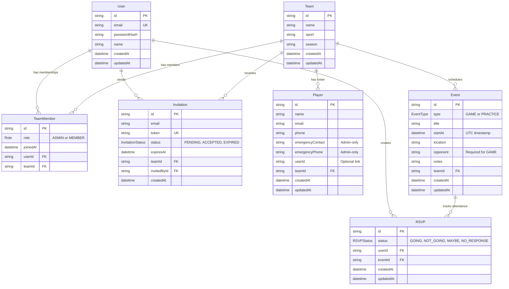

# Prisma Database Schema

This directory contains the Prisma schema and database migrations.

## Files

- `schema.prisma` - Database schema definition with all models
- `migrations/` - Database migration history (created after first migration)

## Database Models

### Core Models

1. **User** - User accounts with authentication
2. **Team** - Sports teams with season information
3. **TeamMember** - Junction table linking users to teams with roles (ADMIN/MEMBER)
4. **Player** - Roster entries with contact and emergency information
5. **Event** - Games and practices with scheduling details
6. **RSVP** - Availability tracking for events
7. **Invitation** - Email invitations to join teams

### Relationships

- User ↔ Team: Many-to-many through TeamMember (with role)
- Team → Player: One-to-many (roster)
- Team → Event: One-to-many (schedule)
- User ↔ Event: Many-to-many through RSVP (with status)
- Team → Invitation: One-to-many (pending invites)

### Entity Relationship Diagram



**Legend:**

- `PK` = Primary Key
- `FK` = Foreign Key
- `UK` = Unique Key
- `||--o{` = One-to-many relationship
- All foreign key relationships have `ON DELETE CASCADE` except `Invitation.invitedById` which uses `RESTRICT`

## Running Migrations

### First Time Setup

After configuring your DATABASE_URL in `.env.local`:

```bash
bunx prisma migrate dev --name init
```

This creates the initial database schema and generates the Prisma Client.

### Creating New Migrations

When you modify `schema.prisma`:

```bash
bunx prisma migrate dev --name descriptive_name
```

### Applying Migrations in Production

```bash
bunx prisma migrate deploy
```

### Reset Database (Development Only)

⚠️ This will delete all data:

```bash
bunx prisma migrate reset
```

## Prisma Studio

View and edit your database visually:

```bash
bunx prisma studio
```

Opens at [http://localhost:5555](http://localhost:5555)

## Generating Prisma Client

The Prisma Client is automatically generated when you run migrations. To manually regenerate:

```bash
bunx prisma generate
```

## Schema Validation

Check if your schema is valid:

```bash
bunx prisma validate
```

Format your schema:

```bash
bunx prisma format
```
