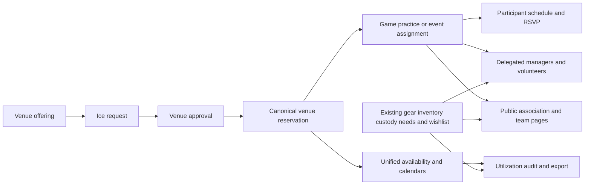

# Implementation Plan: Association Operations

**Branch**: `mbeacom-association-platform-roadmap` (`SPECIFY_FEATURE=007-association-operations`) | **Date**: 2026-08-16 | **Spec**: [spec.md](./spec.md)  
**Input**: Feature specification from `specs/007-association-operations/spec.md`

## Summary

Extend the existing `League` aggregate into a complete association operating surface while treating the merged gear stack (PRs #331-#335) as an implemented bounded context. The critical path introduces `VenueReservation`—explicitly distinct from existing `GearReservation`—as the authoritative venue-occupancy boundary, converts approved ice requests into venue reservations, links games/practices/events to them, and migrates all occupancy writers and calendar readers through one transaction-safe service. Season-specific placement and reservation-driven scheduling complete the P1 workflow. Scoped responsibilities (including equipment managers), volunteers, public association/team pages, content, gear-aware operations, federated audit visibility, and portable exports follow without rebuilding gear inventory or custody.

## Technical Context

**Language/Version**: TypeScript strict mode, Next.js 16 App Router, React 19  
**Primary Dependencies**: MUI 7/Emotion, Prisma 7, Neon PostgreSQL adapter, Auth.js 5, Zod 4, Bun  
**Storage**: PostgreSQL through Prisma; optional provider-backed media remains outside core reservation data  
**Testing**: Vitest, Testing Library, PostgreSQL-backed concurrency and migration verification  
**Target Platform**: Responsive web application on Node-compatible hosting; self-hostable with PostgreSQL  
**Project Type**: Next.js web application with React Server Components and Server Actions  
**Performance Goals**: At the documented scale of 100 teams, 5,000 participants, 10 venues, and 25,000 annual commitments, conflict previews complete within 2 seconds at p95 and reservation commits within 3 seconds at p95 excluding external notification delivery  
**Constraints**: No raw application SQL; exact-resource authorization; venue-local time; public youth-data privacy; core workflows cannot require payment or proprietary storage; migrations and rollback must preserve existing commitments  
**Scale/Scope**: Multi-team nonprofit associations, with CAHA-like age groups/divisions, distributed team officials and volunteers, and multiple venue partners

## Constitution Check

The repository constitution file is an unfilled template, so constitution alignment is indeterminate. Project ADRs and repository instructions are the operative reviewable gates until a constitution is ratified.

| Gate | Result | Evidence |
| --- | --- | --- |
| Constitution principles | Indeterminate | `.specify/memory/constitution.md` is an unfilled template |
| Mutations use authenticated, validated Server Actions | Pass | ADR-0002; actions remain in `lib/actions/` |
| PostgreSQL access uses Prisma only | Pass | ADR-0003; reservation checks use Prisma transaction clients |
| UI remains MUI-first and responsive | Pass | ADR-0004; new UI follows existing feature component patterns |
| Tooling remains Bun | Pass | ADR-0005 |
| League-owned gear projections, append-only ledgers, and one durable outbox remain authoritative | Pass | Accepted ADR-0006; feature 007 integrates without duplicating the gear bounded context |
| Public selectors exclude private youth/household data | Pass | Dedicated public association/team selectors are planned |
| Schema changes ship with migrations and regenerated client | Pass | Expand/backfill/cutover migration sequence is explicit |
| Architectural change is recorded | Required before implementation | Canonical venue reservation ADR-0007 and free/provider-portable core ADR-0008 require review |

No gate violation is required.

## Critical Path



1. **P1a — Reservation MVP**: offering → request → approval → confirmed reservation → practice assignment → participant Event/RSVP → one schedule entry.
2. **P1b — Scheduling cutover**: migrate every occupancy writer; publication-time rechecks; season-specific placements; reservation-driven games/proposals/generation; canonical calendars and ICS.
3. **P2 — Association operations**: scoped grants, volunteers, public profiles/team directory, news/announcements, meaningful notification outcomes.
4. **P3 — Accountability and portability**: utilization, unified audit access, complete association JSON export, self-hosting operations documentation.

## Design Decisions

### Canonical Venue Occupancy

- Add `VenueReservation` as the only long-term source of venue occupancy.
- Keep domain schedule fields as searchable/display snapshots, but link all venue-based activities to their reservation.
- Allow a linked `SeasonGame` and participant-facing `Event` to share one reservation; readers deduplicate by reservation ID.
- Treat requestable `VenueScheduleBlock` rows as offerings, not occupancy.
- Materialize finite venue activities/closures as reservations.
- During rollout, read reservations plus legacy occupancy that has no reservation link; remove legacy reads only after verification.

### Transaction Safety

- Add a short, serializable Prisma transaction wrapper with bounded retry for write conflicts.
- Reload authorization and resource ancestry inside the transaction.
- Detect reservation conflicts immediately before commitment.
- Write the reservation, lifecycle history, override record, activity links, audit record, and queued notification records atomically.
- Never call email, payment, or media providers inside the scheduling transaction.

### Association Root and Identity

- Extend `League`; do not add a competing `Association` model.
- Preserve stable association/team slugs and record redirects when administrators intentionally change them.
- Keep `TeamOfficial` descriptive and permission-neutral.
- Add scoped association grants for operational responsibilities while retaining existing admin roles during compatibility rollout.

### Existing Gear Bounded Context

- Preserve the merged League-owned gear catalog, storage, pooled/tagged inventory, team needs, `GearReservation` custody, allocations, handoffs, movements, wishlist/pledges, append-only ledgers, and durable `NotificationOutbox` governed by ADR-0006.
- Use the explicit `VenueReservation` name across new schema, services, actions, tests, routes, components, and copy; do not introduce an ambiguous generic `Reservation` service beside `GearReservation`.
- Add `EQUIPMENT_MANAGER` as a scoped responsibility that maps to existing `Permission.MANAGE_GEAR_INVENTORY`, `MANAGE_GEAR_WISHLIST`, `CREATE_TEAM_GEAR_NEED`, and `REQUEST_TEAM_GEAR` according to grant scope.
- Surface urgent gear needs, overdue custody, inventory attention, and gear notification health in the association operations read model; do not place gear custody windows into venue occupancy.
- Link a published gear wishlist from the public association profile through the existing token-protected route and selector; do not expose donor/custodian PII or private storage/inventory details.
- Federate `GearActivity`, `GearHandoff`, and `GearInventoryMovement` into audit views and exports without copying or weakening the authoritative append-only ledger.

### Durable Notifications

- Reuse the generic `NotificationOutbox` and `NotificationService` ownership established by ADR-0006.
- Keep bounded event registries: the existing gear registry remains authoritative for gear events; feature 007 adds an association-operations registry for venue reservations, volunteers, schedules, and public content.
- Keep `gear-outbox-worker.ts` as the exclusive claim/retry owner for `gear.*` events under ADR-0006. Add a registry-filtered association-operations worker that claims only its non-gear event namespace; both may share low-level lease/retry helpers without sharing event ownership.
- Keep worker lifecycle status separate from terminal delivery outcome so provider-accepted, batched, suppressed, stale/canceled, and failed results remain honest.
- Enqueue notification intent inside the domain transaction and deliver only after commit.

Equipment-manager scope matrix:

| Grant scope | Allowed existing gear permissions | Denied/unsupported |
| --- | --- | --- |
| Association | Manage inventory and wishlist; create/request needs for any association team | No scheduling, finance, role administration, or venue authority |
| Division | Create/request needs only for teams currently in the division | Inventory/wishlist administration and other divisions |
| Team | Create/request needs only for the exact team; `teamId` is mandatory | Inventory/wishlist administration and other teams |
| Season/Event | None; fail closed | All gear permissions until an explicit use case is specified |

Default operational role matrix (all grants remain bounded by their declared scope):

| Role | Allowed capabilities | Supported scopes |
| --- | --- | --- |
| Association admin | All association capabilities, conflict override, audit, and export | Association |
| Scheduler | Manage venue reservations, schedules, games, proposals, and practices | Association, division, team, season |
| Registrar | Manage rosters, placements, registration eligibility, and registration reporting | Association, division, team, season |
| Treasurer | Manage association payments, refunds, and financial reports | Association |
| Communications lead | Publish content and send operational communications | Association, division, team |
| Team manager | Manage the exact team, roster operations allowed to team admins, team events/practices, volunteers, and team gear needs/requests | Team |
| Coach | Manage practice plans and team practice participation | Team, season |
| Volunteer coordinator | Manage volunteer needs and assignments | Association, division, team, season, event |
| Event manager | Manage the exact Event or SignupEvent without broader host administration | Event, signup event |
| Equipment manager | Existing gear permissions according to the equipment scope matrix above | Association, division, team |

Any role/scope/capability combination not listed fails closed. Guardian and
participant behavior derives from membership/guardian relationships and is not
granted through `AssociationRoleGrant`.

### Season and Practice Continuity

- Add season-specific team placement while preserving immutable placement history.
- Generate and publish games from confirmed unassigned reservation inventory.
- Recheck every generated or proposed game at publication.
- Link a scheduled `PracticeSession` to one participant-facing `Event` and one reservation so the plan, attendance, and ice commitment stay together.

### Open Service and Portability

- Core scheduling, registration, communication, reporting, and export work without Stripe or media storage.
- Export one schema-versioned JSON document containing association-owned relational data, including gear projections and ledger references with private donor/custodian fields excluded or redacted; existing CSV/ICS exports remain available.
- Optional provider references are represented as portable metadata; provider failure cannot invalidate core records.
- No per-player entitlement, platform commission, or proprietary-host requirement is introduced for core association operations.

## Project Structure

### Documentation

```text
specs/007-association-operations/
├── spec.md
├── plan.md
├── research.md
├── data-model.md
├── quickstart.md
├── contracts/
│   ├── public-routes.md
│   ├── venue-reservation-actions.md
│   └── association-actions.md
├── checklists/
│   └── requirements.md
└── tasks.md
```

### Source Code

```text
prisma/
├── schema.prisma
└── migrations/

lib/
├── actions/
│   ├── venue-reservations.ts
│   ├── association-profile.ts
│   ├── association-roles.ts
│   ├── public-content.ts
│   └── volunteers.ts
├── auth/
│   └── capabilities.ts
├── data/
│   └── schedule-items.ts
├── services/
│   ├── venue-reservation-transaction.ts
│   ├── venue-reservation-availability.ts
│   ├── venue-reservations.ts
│   ├── association-operations-notification-registry.ts
│   ├── association-operations-outbox-worker.ts
│   ├── notification-outbox-lease.ts
│   ├── association-utilization.ts
│   └── association-export.ts
└── utils/
    └── validation.ts

app/
├── (dashboard)/league/[leagueId]/
│   ├── operations/
│   ├── venue-reservations/
│   ├── workforce/
│   ├── content/
│   ├── utilization/
│   ├── audit/
│   ├── data-export/
│   └── settings/public/
├── (marketing)/associations/[slug]/
│   ├── page.tsx
│   ├── schedule/
│   ├── teams/
│   └── news/
└── api/associations/[slug]/schedule.ics/route.ts

components/features/
├── association-operations/
├── association-profile/
└── workforce/

scripts/
├── backfill-venue-reservations.ts
├── backfill-season-placements.ts
├── backfill-association-role-grants.ts
└── verify-venue-reservation-cutover.ts

__tests__/
├── lib/services/
├── lib/actions/
├── integration/
├── components/features/
├── app/
├── api/
└── scripts/
```

**Structure Decision**: Preserve the existing single Next.js application. Server Actions remain the mutation boundary, route handlers are limited to file-style exports, services centralize reservation invariants, and feature components align with existing association, venue, season, and practice domains.

Existing merged gear files remain in `lib/actions/gear-*.ts`, `lib/services/gear-*.ts`, `components/features/gear/`, and `app/(dashboard)/league/[leagueId]/gear/`. Feature 007 adds read-model, capability-map, public-link, notification-worker, audit-view, and export integrations around them; it does not move or rename the gear bounded context.

## Phase 0 - Research Decisions

Research is recorded in [research.md](./research.md). All technical unknowns are resolved:

- canonical reservation instead of five independent occupancy sources;
- serializable Prisma transactions with bounded retry instead of raw locking SQL;
- direct typed activity links instead of a generic polymorphic table;
- dual-read/backfill/cutover instead of a flag-day migration;
- stable slugs with redirects;
- scoped capability grants independent of descriptive official roles;
- reuse of the existing gear bounded context, permissions, append-only ledgers, and durable outbox;
- schema-versioned JSON association export without mandatory proprietary storage.

## Phase 1 - Data and Contracts

- [data-model.md](./data-model.md) defines venue reservation lifecycle, schedule-block intent, season placement, profiles/content, scoped grants, volunteers, gear integration, notification outcomes, and their migration states.
- [contracts/venue-reservation-actions.md](./contracts/venue-reservation-actions.md) defines venue approval, assignment, lifecycle, conflict, and publication contracts.
- [contracts/association-actions.md](./contracts/association-actions.md) defines profiles, content, grants, volunteers, utilization, and export.
- [contracts/public-routes.md](./contracts/public-routes.md) defines public association/team/schedule privacy boundaries.
- [quickstart.md](./quickstart.md) defines end-to-end validation scenarios.

## Migration and Rollout

1. Begin from `main` containing merged gear PRs #331-#335 and accepted ADR-0006, then ratify ADR-0007 for canonical venue occupancy and ADR-0008 for free/provider-portable core association operations.
2. Expand the schema with nullable reservation links, lifecycle history, schedule-block intent, and indexes.
3. Add dual-read reservation availability while excluding requestable offerings from occupancy.
4. Ship request approval → reservation and reservation → practice assignment.
5. Backfill in order: season game/Event pairs, practices, event games, standalone events, accepted requests, finite occupying venue blocks.
6. Preserve legacy overlaps as explicit migration overrides and surface them for reconciliation.
7. Migrate all writers: requests, venue blocks/content, Events, season games/generation/proposals, signup events/EventGames, practices, surface archival.
8. Add season-specific placement and reservation-driven generation.
9. Cut availability, calendars, ICS, reports, and venue boards to reservations only.
10. Apply each later schema slice and migration serially—season placement, roles/volunteers, profiles/content, then outbox outcomes—regenerating the client before its dependent actions; implementation outside `prisma/schema.prisma` may proceed in parallel afterward.
11. Add scoped grants (including equipment management), volunteers, profiles/content with public wishlist integration, gear-aware operations, federated audit access, and export.
12. Track legacy-reader removal as a separate post-release change only after two stable releases and a clean cutover verification report.

Rollback remains additive until the final cleanup: readers can return to dual mode without discarding reservation data.

## Test Strategy

- Unit-test interval, segment coexistence, lifecycle, ownership, capability, public selector, utilization, and export rules.
- Action-test exact authorization, input validation, atomic linkage, revalidation, notifications, and audit records.
- PostgreSQL integration-test overlapping approvals and simultaneous scheduling attempts.
- Contract-test every occupancy writer against every conflicting source.
- Migration-test idempotent backfills, linked game/Event deduplication, and preserved legacy overlaps.
- Rollback-test canonical-to-dual-read recovery before any reader cutover.
- Component-test request decisions, reservation assignment, operations dashboard, roles, volunteers, profile publishing, and privacy.
- Route-test public association/team pages, ICS, and association export.
- Provider-absence-test scheduling, registration, volunteers, communications, reporting, and export with payments/media disabled and provider failures surfaced.
- Performance-test reservation preview and commit latency at the documented association scale.
- Regression-test existing gear inventory, custody, needs, wishlist/pledge, notification, capability-token privacy, and append-only ledger contracts after shared capability/outbox/audit/export integration.

## Post-Design Constitution Check

All reviewable ADR and repository-instruction gates still pass; constitution alignment remains indeterminate until the placeholder constitution is replaced. The design preserves accepted gear ADR-0006, does not add raw SQL, a competing mutation interface, a second association aggregate, a second notification outbox, a proprietary core dependency, or a non-MUI UI system. New architectural commitments are routed to ADR-0007 and ADR-0008 review before implementation.

## Complexity Tracking

None. The added services and entities replace fragmented occupancy and authorization behavior rather than introducing parallel long-term architectures.
